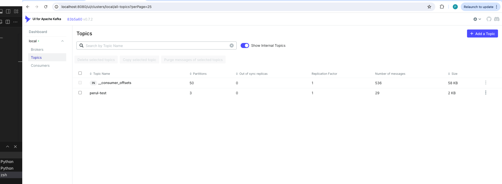
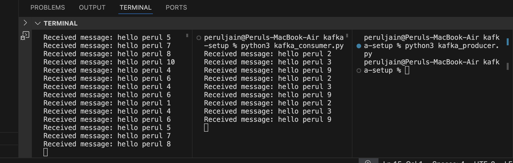

# Kafka Setup Local

## Steps to follow

1. docker-compose up -d
2. go to http://localhost:8080/
3. Create topic 
4. replace topic name and run python kafka_producer.py
5. replace topic name and run python kafka_consumer.py

### Results

1. Kafka UI Screenshot

2. 3 paritions, 2 consumers
 

